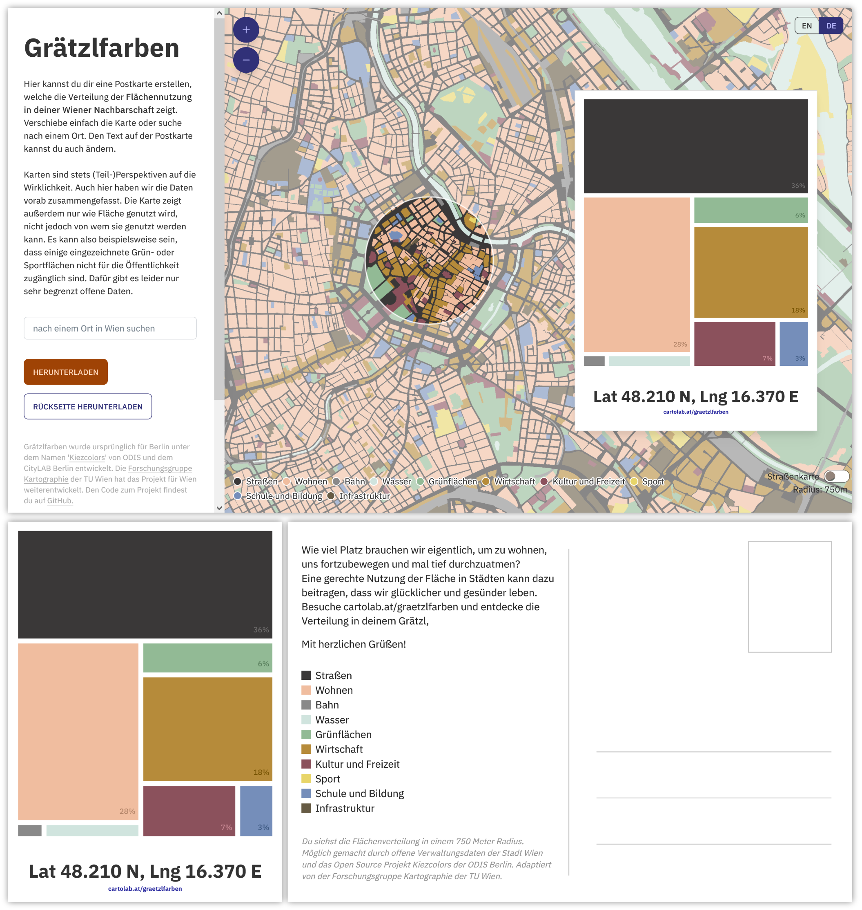

# Grätzlfarben, aka Kiezcolors

*Grätzlfarben* is a map based tool that creates a postcard showing the landuse distribution in your neighborhood in Vienna. It is based on the [Kiezcolors](https://kiezcolors.odis-berlin.de) tool of the [Open Data Informationsstelle Berlin](https://odis-berlin.de/).
By zooming in and out you can pick a location and position it inside the circle. *Grätzlfarben* then maps the individual areas onto a tree map diagram.
You can print the resulting motive as a postcard and share it!



## Tech stack

This website is a [Svelte](https://svelte.dev/) app. The map is rendered using [MapLibre GL JS](https://maplibre.org/maplibre-gl-js/docs/) with vector tiles, and the analysis is done using [Turf.js](https://turfjs.org/). The app is built as a fully static app and does not require any active server technology.

## Developing

Install dependencies by running:

```bash
npm install
```

Start a development server by running:

```bash
npm run dev
```

or start the server and open the app in a new browser tab

```bash
npm run dev -- --open
```

## Building

To create a production version of your app:

```bash
npm run build
```

You can preview the production build with `npm run preview`.

To deploy your app, simply copy the `build` folder to your web server.

## Data

For Vienna, the 'Realnutzungskartierung' dataset by the City of Vienna is suitable for the application and [available as a WFS](https://www.data.gv.at/katalog/dataset/2f5baa1f-208c-42c2-8d04-9ea74aa1b229#resources). QGIS can be used to project it to ```EPSG:4326``` and save it (with layername 'landuse-data') as ```GeoJSON```, which is required to create the vector tiles for the map.

The most detailed information on landuse was used, based on the NUTZUNG_CODE or the NUTZUNG_LEVEL3 column.
  
## Tile Creation

The tiles were created with *tippecanoe*. To [use tippecanoe on Windows, you need to install Ubuntu](https://gist.github.com/ryanbaumann/e5c7d76f6eeb8598e66c5785b677726e)

To then use tippecanoe, open the Ubuntu shell, change directory to c/ by `cd ../../mnt/c`, change directory to tippecanoe folder and `sudo make install`, enter sudo password. 

After changing to the directory where the input file is located, you can make the tiles by running the following command:

```bash
tippecanoe --output-to-directory ./tiles --layer "landuse-data" --no-tile-compression --force --minimum-zoom=10 --maximum-zoom=13 ./{input-file}.geojson
```

Your input data has to be in ```GeoJSON``` format and in the ```EPSG:4326``` projection. 

## Data Licence

The landuse data *Realnutzungskartierung Wien 2022* can be downloaded from the [Open Data Portal Austria](https://www.data.gv.at) and is licenced under CC BY 4.0 DEED.


## Adapting to your city

The application is built to be easily implemented in other cities if suitable data is available. All variables to be adapted can be found in [`src/lib/settings.js`](src/lib/settings.js). The texts can be changed in ['src/locales](src/locales/). Images and tiles have to be exchanged in ['src/static'](src/static).

## Kiosk mode

For use in public settings, Grätzlfarben can be run in "kiosk mode", which offers a single print button instead of download buttons for the postcard images. Only printing the postcard front (the treemap visualizaton) is supported in kiosk mode -- it is assumed that postcards pre-printed with the back side are provided on site.

To activate kiosk mode in the app, append the `?kiosk` url parameter *before* the `#` sign in the url, for example:

```
http://localhost:5173/?kiosk#13/48.20996/16.3704
```

You can start most browsers in kiosk mode, which causes the app to be displayed in full screen, disables any user interface elements, and supports printing without showing a dialog. E.g. for Firefox, the command to launch the app in kiosk mode would be:

```
"C:\Program Files\Mozilla Firefox\firefox.exe" -kiosk -private-window https://cartolab.at/graetzlfarben/?kiosk
```

## Contributing

Before you create a pull request, write an issue so we can discuss your changes.

## Contributors

ODIS Berlin / CityLAB Berlin has made the biggest contribution by developing and coding the initial [Kiezcolors](https://kiezcolors.odis-berlin.de) tool. On part of the research unit cartography at TU Wien, [Ester Scheck](https://github.com/ester-t-s) and [Florian Ledermann](https://github.com/floledermann) mostly worked on the code and the documentation while Sacha Schlumpf and Andrea Binn supported with feedback and brainstorming ideas.

## Contact

If you have any questions, please contact [ester.scheck@geo.tuwien.ac.at](mailto:ester.scheck@geo.tuwien.ac.at)


## Content Licensing

Texts and content available as [CC BY](https://creativecommons.org/licenses/by/3.0/de/).


## Related Projects

[Kiezcolors Berlin](https://kiezcolors.odis-berlin.de)